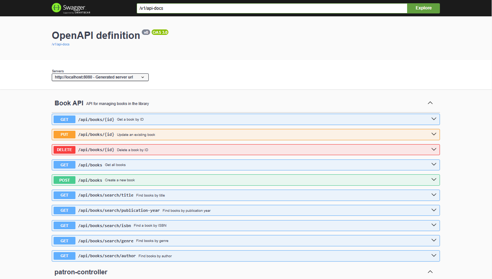

# Library Management System

## Description

The Library Management System is a demo of a web application designed to manage the borrowing and returning of books in a library. It provides features for patrons to manage their accounts, view available books, and keep track of their borrowing records. Additionally, administrators can manage users, books, and borrowing records through an intuitive interface.

This project utilizes Spring Boot for the backend, providing a robust and scalable architecture. It also implements JWT authentication for secure access to the API endpoints.




## Project Structure
```markdown
library-management-system/
│
├── src/
│   ├── main/
│   │   ├── java/
│   │   │   └── com/
│   │   │       └── library/
│   │   │           └── demo/
│   │   │               ├── config/                 # Configuration files for Spring Security and other settings
│   │   │               ├── controller/             # REST controllers for handling API requests
│   │   │               ├── dto/                    # Data Transfer Objects for request and response bodies
│   │   │               ├── middleware/             # Custom middleware such as request logging
│   │   │               ├── model/                  # Entity classes representing database tables
│   │   │               ├── repository/             # Repository interfaces for data access
│   │   │               ├── security/               # Security-related classes such JWT authentication - Todo
│   │   │               ├── service/                # Service classes containing business logic
│   │   │               ├── test/                   # Unit test cases - Todo
│   │   │               └── validation/             # Custom validation classes
│   │   └── resources/
│   │       ├── application.properties              # Configuration properties
│   │       └── ...                                 # Other resources such as static files or templates
│   └── test/
│       └── java/
│           └── com/
│               └── library/
│                   └── demo/                       # Test classes for unit and integration tests
│
├── pom.xml                                           # Maven project file for dependency management
└── README.md                                         # This README file
```

## Prerequisites
- Java 17 or higher
- MySQL or MariaDB
- Maven
- An IDE such as IntelliJ IDEA or Eclipse

## How to Clone and Run the Project

1. **Clone the repository**:
   Open your terminal and run the following command:
   ```bash
   git clone https://github.com/aref2008/library-management-system.git
   ```

2. **Navigate to the project directory**:
   ```bash
   cd library-management-system
   ```

3. **Configure the database**:
   Before running the application, you need to set up the database. Open your MySQL command line or a database management tool and run the following SQL commands:
   ```sql
   CREATE DATABASE library_db;
   CREATE USER 'library_user'@'localhost' IDENTIFIED BY 'password123';
   GRANT ALL PRIVILEGES ON library_db.* TO 'library_user'@'localhost';
   FLUSH PRIVILEGES;
   ```
   Make sure to replace `'password123'` with a strong password of your choice.

4. **Install dependencies**:
   Run the following command to download the required dependencies:
   ```bash
   mvn install
   ```

5. **Run the application**:
   You can run the application using Maven:
   ```bash
   mvn spring-boot:run
   ```

6. **Access the API**:
   Once the application is running, you can access the API endpoints at `http://localhost:8080/api`. You can use tools like Postman or curl to interact with the API.

## API Documentation

You can find the API documentation by accessing the Swagger UI at `http://localhost:8080/swagger-ui/` after starting the application.

## Contributing

Contributions are welcome! If you want to contribute to this project, please create a pull request or raise an issue.

## License

This project is licensed under the MIT License - see the [LICENSE](LICENSE) file for details.

## Acknowledgments

- Thanks to the Spring community for providing great tools and frameworks.
- Inspired by various open-source projects and the need for an efficient library management system.
```
